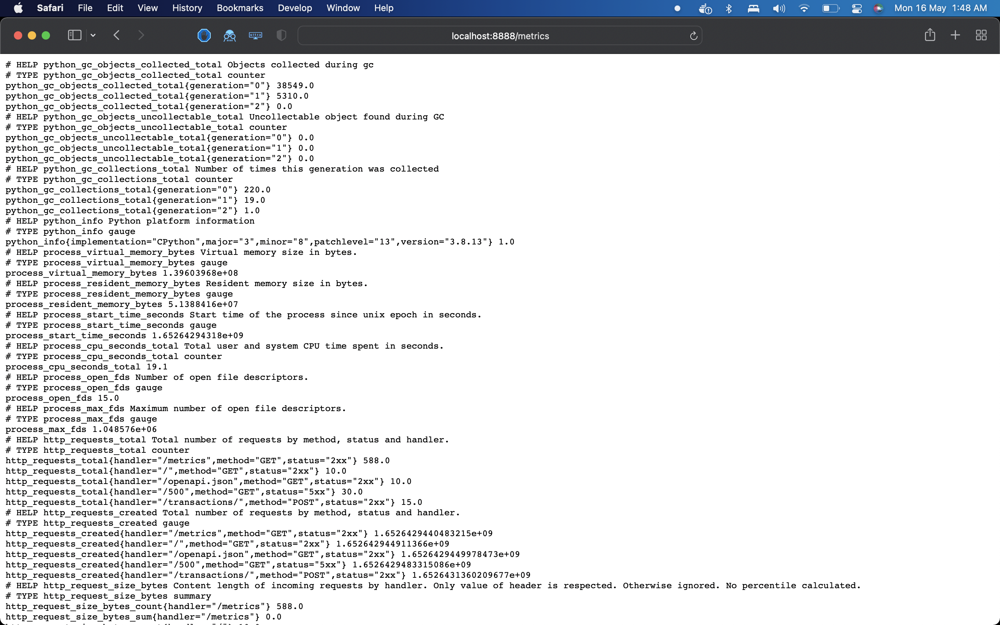
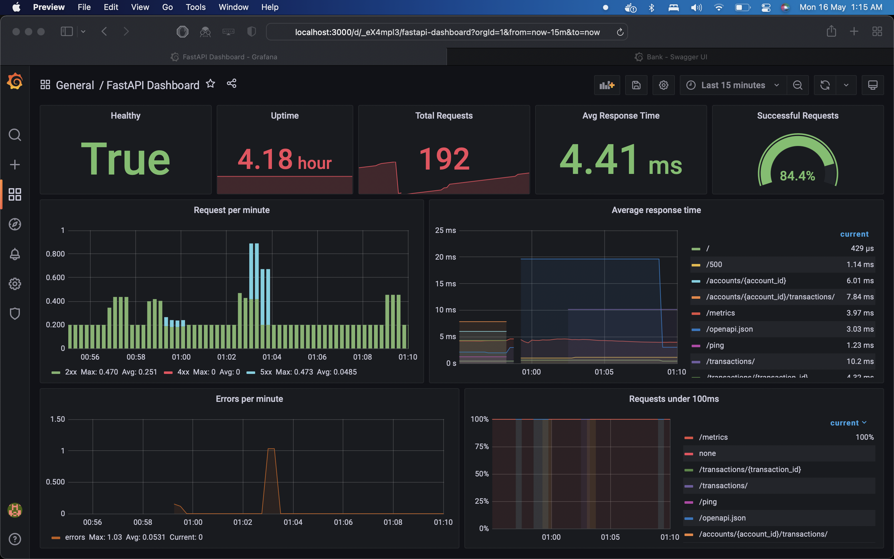
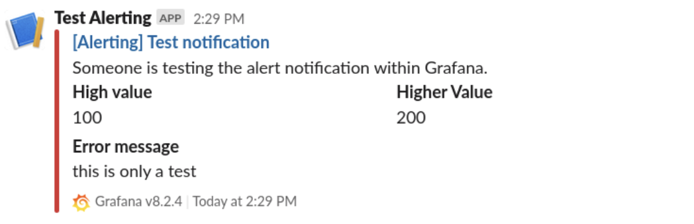

# Independent Study Report

Name: Akshat Chhajer \
Roll No: 2018114008 \
Semester: Spring 2022 \
Credits: 2 


## Topic
> Developing monitoring for API based applications

## Solution: FastAPI Monitoring Demo

A stack for monitoring FastAPI applications using prometheus and grafana.

- Github Link: https://github.com/akshatcx/fastapi-monitoring
- Live deployment: 65.1.162.101:3000

## Introduction
During development and maintenance of microservices things go wrong. In many situations the problems root cause resides in the application code. It’s essential to have insight into the internals of the application. But how to enable observability of numerical values to ease understanding applications and troubleshoot problems? To solve this, a well-accepted practice to monitor software systems is presented so that we can understand performance characteristics, react quickly to system failures,

In the following demo, we will collect metrics from the API server using `Prometheus` and visualize the results in a `Grafana` dashboard.

## Technologies (Microservices)
- FastAPI \
FastAPI is a modern, fast (high-performance), web framework for building APIs with Python 3.6+ based on standard Python type hints. It is known for very high performance, which is said to be on par with NodeJS and Go (thanks to Starlette and Pydantic). It provides built in support for OpenAPI documentation and is designed to be easy to learn and use out of the box.

- Postgres \
Postgres is a open source relational database management system based on SQL. It is used by the API server to store data in this application.

- Prometheus \
Prometheus is a open source time series database used for event monitoring and alerting. It records real-time metrics in a time series database built using a HTTP pull model, with flexible queries. Prometheus collects and stores its metrics as time series data, i.e. metrics information is stored with the timestamp at which it was recorded, alongside optional key-value pairs called labels.

- Grafana \
Grafana is an open source visualization tool that can be used on top of a variety of different data stores but is most commonly used together with Graphite, InfluxDB, Prometheus, and Elasticsearch. It enables users to easily create and edit beautiful dashboards which can visualize almost any kind of data and well as logs.

- Docker/Docker Compose \
Docker is an operating system virtualization technology that allows applications to be packaged as containers. This is a very fundamental part of cloud computing, as containerized applications can be run on any type of infrastructure, regardless of the provider. 
Compose is a tool for defining and running multi-container Docker applications. With Compose, we use a YAML file to configure your application’s services. Then, with a single command, you create and start all the services from your configuration.


## FastAPI application: Banking Solution
Here to demostrate monitoring, I have created a simple API for banking in FastAPI. It enables users to create accounts as well as add transactions to track their account balance.

It uses postgres as its main database to store this information.
#### Models
```python
class Account(Base):
    __tablename__ = "accounts"

    id = Column(Integer, primary_key=True, index=True)
    first_name = Column(String)
    last_name = Column(String)
    address = Column(String)


class Transaction(Base):
    __tablename__ = "transactions"

    id = Column(Integer, primary_key=True, index=True)
    acc_id = Column(Integer, ForeignKey("accounts.id"))
    credit = Column(Integer)
    debit = Column(Integer)

```

#### Routes (OpenAPI documentation)


#### Metrics
A middleware is used which notes the various metrics and publishes them to the route `/metrics`. This includes information such as number of http requests, status codes, time to statisfy those requests etc. Following is an example of a GET request to `/metrics` route.



## Prometheus
Prometheus reads the metrics present at the above mentioned route and saves the data in a structured time series format. It scrapes the data with a set `scrape_interval` which is later used by grafana to visualize. It also scrapes data from its own metrics endpoint and can be used later to monitor prometheus itself too.

This data can be queried using a special language called `PromQL`

Below is the prometheus config for this project.

```yaml
global:
  scrape_interval: 5s 
  evaluation_interval: 5s

scrape_configs:
  - job_name: 'prometheus'
    static_configs:
      - targets: ['localhost:9090']

  - job_name: 'api'
    static_configs:
    - targets: ['api:8888']
```

## Grafana
In grafana, dashboards are created which query prometheus and visualize the data in almost any format. These formats include time series charts, counters, histograms, bar graphs etc.

Here prometheus is added as a grafana datasource with the following config.

```yaml
apiVersion: 1

deleteDatasources:
  - name: Prometheus
    orgId: 1

datasources:
  - name: Prometheus
    type: prometheus
    access: proxy
    orgId: 1
    url: http://prometheus:9090
    basicAuth: false
    isDefault: true
    version: 1
    editable: true
```

The following monitoring dashboard was created as part of this project using the time series data from prometheus.



## docker compose deployment
This entire stack is deployed using docker compose. The config for the same can be found here.

```yaml
version: '3'

services:
  postgres:
    image: postgres:latest
    ports:
      - "5432:5432"
    environment:
      - POSTGRES_USER=$POSTGRES_USER
      - POSTGRES_PASSWORD=$POSTGRES_PASSWORD
      - POSTGRES_DB=$POSTGRES_DB
    volumes:
      - db-data:/var/lib/postgresql/data/

  api:
    build: api
    ports:
      - "8888:8888"
    command: "python main.py"
    environment:
      - DB_URI=$DB_URI
  
  prometheus:
    image: prom/prometheus:latest
    volumes:
      - prometheus-data:/prometheus
      - ./prometheus.yml:/etc/prometheus/prometheus.yml
    restart: unless-stopped
    ports:
      - 9090:9090

  grafana:
    image: grafana/grafana:latest
    volumes:
      - grafana-data:/var/lib/grafana
      - ./datasource.yml:/etc/grafana/provisioning/datasources/datasource.yml
    environment:
      - GF_SECURITY_ADMIN_USER=$GF_SECURITY_ADMIN_USER
      - GF_SECURITY_ADMIN_PASSWORD=$GF_SECURITY_ADMIN_PASSWORD
      - GF_USERS_ALLOW_SIGN_UP=false
    ports:
      - "3000:3000"
      
volumes:
  db-data:
  prometheus-data:
  grafana-data:
```

## Files

```
.
├── README.md
├── api                             # fastapi application
│   ├── Dockerfile                  # Dockerfile to build the api
│   ├── main.py                     # main file to run api
│   ├── requirements.txt            # pip requirements for api
│   └── server                      # server files for api
│       ├── crud.py                 # crud to handle db operations
│       ├── database.py             # database config
│       ├── models.py               # sql models
│       └── schemas.py              # pydantic schemas
├── dashboards                      # grafana dashboard configs
│   └── fastapi-dashboard.json      # main fastapi monitoring dashboard
├── datasource.yml                  # prom datasource config for grafana
├── docker-compose.yml              # docker-compose file
├── env.example                     # template for env variables
└── prometheus.yml                  # prometheus config
```

## Running
```bash
cp env.example .env
docker-compose up -d --build
```

## Endpoints
- FastAPI endpoint: `localhost:8888`
- FastAPI metrics endpoint: `localhost:8888/metrics`
- Prometheus endpoint: `localhost:9090`
- Grafana Endpoint: `localhost: 3000`

Login into grafana using the creds mentioned in the `.env` file and import the dashboards using `dashbords/*.json`

## Further Work
The following work can be done to take this project forward.

#### Alerting
Grafana natively supports alerting. Thresholds can be set for any charts (eg. average response rate > 100ms) which can be used for sending alerts on slack/email etc. This can be very useful as immediate action can be taken to fix the problem like downtime of a particular service.

Following is an example of a slack alert.



#### Logging
Logging for our FastAPI application can also be setup using `Loki`. Loki is a horizontally scalable, highly available, multi-tenant log aggregation system inspired by Prometheus. It is designed to be very cost effective and easy to operate. It does not index the contents of the logs, but rather a set of labels for each log stream.

Using this, live logs of the application can directly be streamed as a dashboard on grafana. This can be useful for easy debugging on the go of the application which saves developer the time to ssh into the deployment machine and directly checking out logs. 

#### Postgres Visualizations
We can directly visualize the data present in our postgres application by writing SQL queries and represnting them in meaningful dashboard. This can be helpful to gain valuable insights depending on what data is being stored in the database. 

## Credits
Done as part of IS (Independant Study) at SERC IIIT Hyderabad (Spring 2022 semester).
